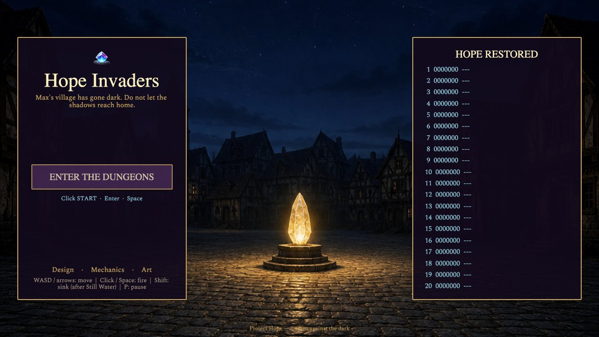
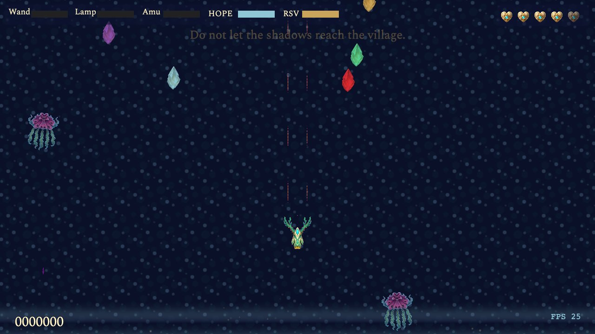
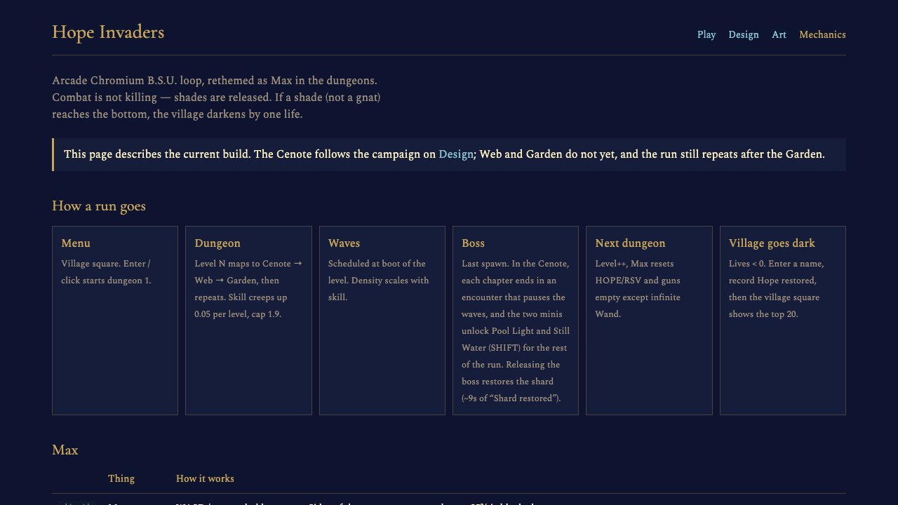
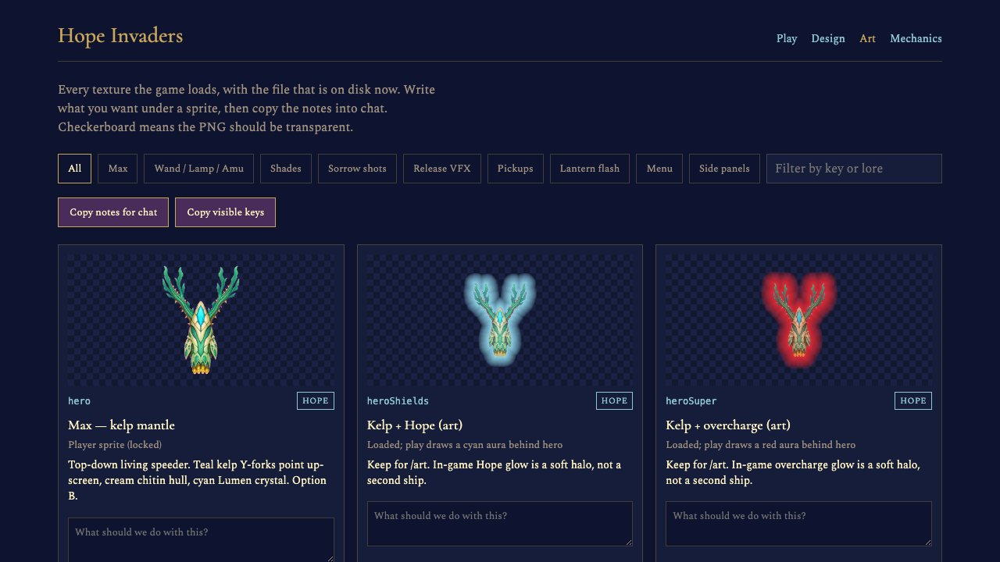
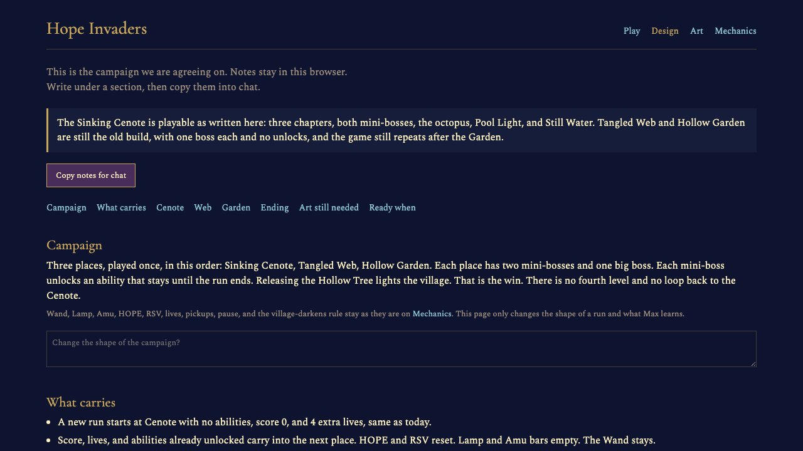

# Hope Invaders

A Phaser 3 vertical shooter: Max flies the dungeons and keeps the village from going dark.

The playable loop is a web port of [Chromium B.S.U.](https://chromium-bsu.sourceforge.io/), rethemed. See **Credits** below.

The campaign we are building toward is the Design page at `/gdd` (notes stay in the browser). The Cenote is built to that campaign; Web and Garden are not yet, so the game still loops the three dungeons.

## Screenshots

| Village square | Sinking Cenote |
| --- | --- |
|  |  |

| Mechanics reference | Art catalog |
| --- | --- |
|  |  |

| Design |
| --- |
|  |

Regenerate after UI changes (dev server must be running):

```bash
npm run dev          # in one terminal
npm run screenshots  # in another
```

## Quick start

```bash
npm install
npm run dev
```

Open http://localhost:5173 in your browser.

## Tests

```bash
npm run test        # run once
npm run test:watch  # watch mode
npm run record      # headless playthrough → recordings/playthrough.mp4
```

## Controls

| Input | Action |
|-------|--------|
| **Enter** (menu) | Start |
| WASD / arrow keys | Move (hold) |
| Left click / Space | Fire |
| Enter (in-game, twice) | Arm, then lantern flash |
| Double right-click | Lantern flash |
| Shift (after Still Water) | Sink for 1 second (shots and shades miss) |
| P | Pause |
| Esc | Return to menu |

After a run, type a name on **RECORD HOPE** and press Enter.

## Credits

Hope Invaders would not exist without **Chromium B.S.U.**, the fast arcade space shooter first released in 2000.

**Chromium B.S.U.**

- [Mark B. Allan](https://chromium-bsu.sourceforge.io/) — original game (Clarified Artistic License)
- [Brian Redfern](https://sourceforge.net/u/brianwredfern/) — sound effects and music, 2008 (MIT/Expat; see `public/assets/wav/license.txt`)
- Later code and packaging: Tristan Heaven, Paul Wise, Max Horn, Sam Hocevar, and other Chromium B.S.U. contributors

Project site: https://chromium-bsu.sourceforge.io/  
Source release: https://sourceforge.net/projects/chromium-bsu/

This repository reimplements that loop in TypeScript. Wave timing, enemy types, guns, pickups, scoring, and much of the feel come from the original. Remaining Chromium assets in this tree:

- `public/assets/wav/` — original sounds (Brian Redfern)
- `public/assets/png/shields.png` — side darken strips

Sprites, menu art, dungeon backdrops, and the Hope story are original to this port. The engine is [Phaser 3](https://phaser.io/).

## License

Hope Invaders is open source under the **Clarified Artistic License** (SPDX: `ClArtistic`) — the same OSI-approved, FSF-free license Chromium B.S.U. uses for code and graphics. See `LICENSE`.

- Game code, Hope art, and remaining Chromium graphics: Clarified Artistic License
- Sound files from Chromium B.S.U.: **MIT/Expat** (`public/assets/wav/license.txt`)
